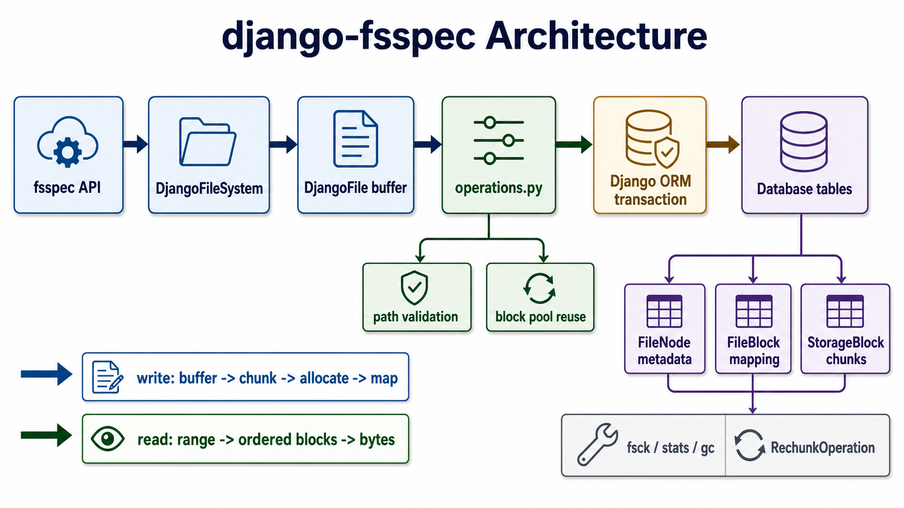

# django-fsspec

基于 Django ORM 的文件系统，通过 [fsspec](https://filesystem-spec.readthedocs.io/) 提供标准接口。



## 特性

- **fsspec 兼容** — 使用标准 `fsspec.filesystem("django")` API
- **多数据库支持** — 通过 Django ORM 适配受支持的关系型数据库
- **可配置块大小** — 按部署需求调整存储粒度
- **乐观锁** — 并发写入冲突检测
- **安全追加 API** — 追加模式使用与公开 API 相同的数据库追加操作
- **命名空间分区** — 整数命名空间提供独立路径空间；授权仍由宿主应用负责
- **路径校验** — 黑名单规则 + Unicode NFC 归一化
- **隐式目录** — 无目录记录，从文件路径推导
- **管理命令** — `fsspec_migrate`、`fsspec_gc`、`fsspec_fsck`、`fsspec_repair`、`fsspec_rechunk`、`fsspec_stats`

## 快速开始

```bash
pip install django-fsspec
```

添加到 `INSTALLED_APPS`：

```python
INSTALLED_APPS = [
    ...
    "django_fsspec",
]
```

运行迁移：

```bash
python manage.py migrate
```

使用：

```python
import fsspec

fs = fsspec.filesystem("django", namespace_id=1)

# 写入
with fs.open("/hello.txt", "wb") as f:
    f.write(b"Hello World")

# 读取
data = fs.cat("/hello.txt")  # b"Hello World"

# 列目录
fs.ls("/")  # ["/hello.txt"]

# 删除
fs.rm("/hello.txt")
```

如果在独立脚本、worker 或 notebook 中使用，请先初始化 Django：

```python
import os
import django

os.environ.setdefault("DJANGO_SETTINGS_MODULE", "your_project.settings")
django.setup()
```

## 配置

在 Django `settings.py` 中添加：

```python
# 块大小（字节），默认 32KB
DJANGO_FSSPEC_BLOCK_SIZE = 32 * 1024

# 文件大小上限（字节），默认 2MB
DJANGO_FSSPEC_MAX_FILE_SIZE = 2 * 1024 * 1024
```

## 支持的文件模式

| 模式 | 说明 |
|------|------|
| `rb` | 只读（文件必须存在） |
| `wb` | 写入（创建或覆盖） |
| `ab` | 追加（创建或追加） |
| `xb` | 排他创建（文件必须不存在） |

## 性能

在 GitHub Actions (ubuntu-latest) 上测试，使用当前默认 32KB 块大小。下表来自 commit `eb8fbc2` 上的 CI run [29259244795](https://github.com/MrLYC/django-fsspec/actions/runs/29259244795)，参数为 `--scale ci --seed 1`。格式：平均延迟（吞吐量）。

| 操作 | SQLite | MySQL 8.0 / Django 4.2 | MySQL 8.0 / Django 5.2 | PostgreSQL 16 / Django 4.2 | PostgreSQL 16 / Django 5.2 | Oracle 23 |
|------|--------|------------------------|------------------------|----------------------------|----------------------------|-----------|
| **写入**小文件 (100B) | 3.8ms (260/s) | 7.1ms (140/s) | 9.9ms (101/s) | 5.9ms (170/s) | 5.8ms (171/s) | 6.9ms (146/s) |
| **写入**中文件 (10KB) | 3.9ms (256/s) | 7.5ms (133/s) | 11.2ms (89/s) | 5.9ms (170/s) | 5.8ms (171/s) | 7.6ms (132/s) |
| **写入**大文件 (1MB) | 11.6ms (86/s) | 45.3ms (22/s) | 71.0ms (14/s) | 36.2ms (28/s) | 37.1ms (27/s) | 37.2ms (27/s) |
| **读取**小文件 (100B) | 1.3ms (796/s) | 2.5ms (405/s) | 2.3ms (430/s) | 2.4ms (415/s) | 2.6ms (387/s) | 3.0ms (331/s) |
| **读取**大文件 (1MB) | 2.3ms (444/s) | 5.2ms (191/s) | 4.2ms (239/s) | 9.3ms (108/s) | 8.8ms (114/s) | 12.8ms (78/s) |
| **列目录** 1000 文件 | 4.0ms (252/s) | 7.0ms (143/s) | 6.5ms (155/s) | 5.9ms (169/s) | 5.9ms (168/s) | 8.5ms (118/s) |
| **删除** | 3.1ms (328/s) | 6.4ms (157/s) | 8.6ms (116/s) | 4.8ms (209/s) | 4.8ms (209/s) | 5.7ms (177/s) |

完整基准测试结果（含并发测试和手动触发的 medium/large 铺底数据集）记录在 [基准测试](docs/zh/benchmarks.md)，也可在 [GitHub Actions artifacts](https://github.com/MrLYC/django-fsspec/actions) 查看。

## 文档

- [快速入门](docs/zh/getting-started.md)
- [配置说明](docs/zh/configuration.md)
- [使用指南](docs/zh/usage.md)
- [架构设计](docs/zh/architecture.md)
- [管理命令](docs/zh/management-commands.md)
- [运维 Runbook](docs/zh/operations-runbook.md)
- [基准测试](docs/zh/benchmarks.md)
- [块大小运维](docs/zh/block-size.md)
- [本地缓存选择指南](docs/zh/local-cache.md)
- [路标](docs/zh/roadmap.md)
- [发布检查清单](docs/zh/release-checklist.md)
- [异常体系](docs/zh/exceptions.md)

[English](README.md) | [英文文档](README.md)

## 许可证

MIT — 见 [LICENSE](LICENSE)。
